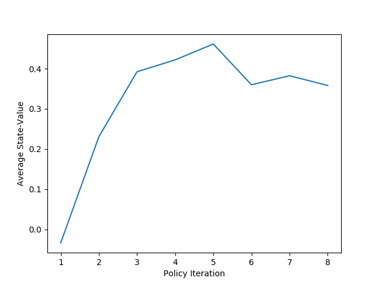
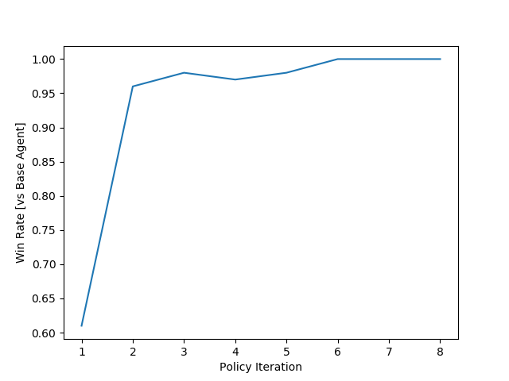

Tictactoe AI using DP Method
=====================

## Run

### Training

```
$ python Train.py
```

### Play games

```
$ python Play.py
```

## Agents

* agent_RL : 강화학습을 진행 할 에이전트
* agent_Base : 랜덤/이기는 수를 두는 비교용 에이전트
* agent_Human : input을 받아서 수를 놓는 에이전트
* value(state) : state를 받아서 current value를 반환합니다.
* policy(state) : state를 받아서 current policy를 반환합니다.

## Environment

* Tictactoe 게임 환경입니다.
* step(action) : action을 받아서 실행하고 observation을 반환합니다.
* render() : 현재 상태를 화면에 출력합니다.
* init()/reset() : 환경을 초기화합니다.

## Learning Algorithm

* Table을 이용한 DP Method를 사용하였습니다.
* Policy Iteration (using iterative policy evaluation)입니다.
* Policy Evaluation과 Policy Improvement를 반복합니다. (GPI)
* 1번의 Iteration마다 agent_Base와 100 Episode씩 테스트합니다.

### Policy Evaluation

* Deterministic한 환경이므로 기대값이 아닙니다.
```
모든 Terminal state가 아닌 state S에 대해서,

V(S) = R + discount_factor * V(S')
```

###  Policy Improvement

* Deterministic한 환경이므로 기대값이 아닙니다.
```
모든 Terminal state가 아닌 state S에 대해서,

Policy(S) = Argmax_a(R + discount_factor * V(S')) s.t step(S,a) = (S',R)
```

* Hyperparameter

```
1. discount_factor : 0.9
2. theta(Policy Evaluation) : 1e-9
```

## Conclusion



* agent_Base와의 대전에서 승률이 100%에 도달했습니다.
* 사람과 비슷한 수준(unbeatable)까지 학습이 되었습니다.
* Q-learning method(off-policy TD)보다 빠르게 Optimal policy에 수렴하였습니다.
* 환경의 모델을 정확하게 결정할 수 있고, state의 개수가 적은 경우에 사용할 수 있습니다.

## Reference

* Richard S. Sutton and Andrew G. Barto. (2018). Reinforcement Learning : An Introduction. 
The MIT Press Cambridge, Massachusetts London, England
